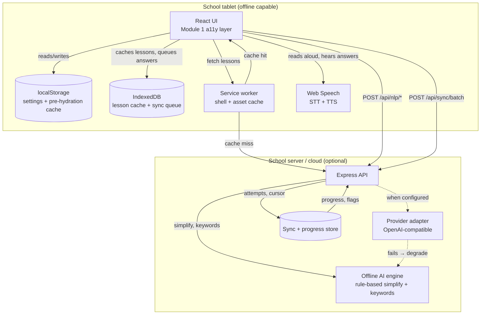

# Architecture

Sahaj Shiksha is an offline-first learning platform for children with learning
difficulties in government and low-resource schools. Everything below follows
from two constraints that are not negotiable in that context:

1. **The network is intermittent and often absent.** A lesson must open, be read
   aloud, be answered, and be recorded with no connection at all.
2. **The device is weak and shared.** An entry-level Android tablet, several
   children, limited storage, no GPU.

## Contents

- [Repository layout](#repository-layout)
- [Module map](#module-map)
- [Data flow](#data-flow)
- [The accessibility kernel](#the-accessibility-kernel)
- [The AI layer](#the-ai-layer)
- [Offline-first strategy](#offline-first-strategy)
- [Deployment topology](#deployment-topology)
- [Decisions and their reasons](#decisions-and-their-reasons)
- [Known gaps](#known-gaps)

## Repository layout

```
sahaj-shiksha/
├── apps/
│   ├── web/                 Next.js PWA (learner + teacher surfaces)
│   │   ├── src/app/         App Router: routes, layout, global CSS, manifest
│   │   ├── src/components/  UI: a11y panel, reading surface, offline, voice
│   │   ├── src/features/    Stateful verticals (a11y settings, voice, commands)
│   │   ├── src/lib/         Framework-free helpers (focus trap, tokenizer, cx)
│   │   └── public/          Service worker, self-hosted fonts, icons
│   └── api/                 Express service (NLP, sync, progress)
│       ├── src/ai/          Provider-agnostic adapters + offline engine
│       ├── src/routes/      HTTP routes
│       ├── src/store/       Storage behind an interface (memory today, SQL next)
│       └── test/            Vitest suites (HTTP + unit)
├── packages/shared/         Single source of truth for cross-app types
│   └── src/
│       ├── a11y/            Settings model, WCAG contrast math, themes, fonts
│       ├── ai/              Adapter contracts, error taxonomy, limits
│       ├── domain/          Quiz, sync and progress types
│       └── nlp/             Readability metrics
└── docs/                    This document, data model, API spec, a11y notes
```

`packages/shared` is consumed as **TypeScript source** (`main`/`types` point at
`src`). The web app compiles it with `transpilePackages`, and the API runs it
through `tsx`. This is deliberate: the settings model, the WCAG contrast maths
and the readability metrics must be identical on both sides of the wire, and a
build step in between is a place for them to drift.

## Module map

| Module | Scope                               | Status          | Where                                             |
| ------ | ----------------------------------- | --------------- | ------------------------------------------------- |
| 1      | Hyper-accessible UI and navigation   | **Implemented** | `web/src/features/a11y`, `web/src/components/a11y` |
| 2      | AI and NLP content engine            | Scaffold        | `api/src/ai`, `web/src/components/reading`        |
| 3      | Stress-free assessment               | Scaffold        | `web/src/app/quizzes`, `shared/src/domain`        |
| 4      | Offline-first runtime                | Scaffold        | `web/public/sw.js`, `api/src/routes/sync.ts`      |
| 5      | Progress and analytics               | Scaffold        | `api/src/routes/progress.ts`, `api/src/store`     |

"Scaffold" means: the contracts, the storage shape, the routes and the design
rules exist and are tested; the user interface is a documented placeholder. Each
scaffold page states the rules the finished module must honour, so those
decisions are visible during implementation rather than after it.

## Data flow



Two properties of this diagram are the point of the whole design:

- **The device is never blocked on the server.** Reading aloud, highlighting,
  navigation, settings and answering are all local. The server adds *better*
  content and *aggregate* analytics, never essential function.
- **The server is never blocked on a provider.** `POST /api/nlp/simplify`
  answers even with no API key, no internet and a proxy that blocks everything,
  via the offline engine described below.

## The accessibility kernel

Module 1 is the foundation every other module builds on, so it is deliberately
the most finished part of the system. It lives in three layers:

**1. The model — `packages/shared/src/a11y`**

- `settings.ts` — the `AccessibilitySettings` shape, inclusive bounds, step
  snapping, and a *total* coercion function. `coerceSettings(anything)` always
  returns valid settings, which is what makes a corrupt localStorage file a
  non-event rather than a blank page.
- `themes.ts` — four complete palettes plus `themeContrastReport()`, which
  recomputes every contractual WCAG ratio from the actual colour values.
- `contrast.ts` — WCAG 2.1 relative luminance and contrast ratio, including
  alpha compositing so `rgba()` values are judged as they visually appear.
- `typography.ts` — font stacks with mandatory generic fallbacks.

**2. The engine — `apps/web/src/features/a11y`**

- `AccessibilityProvider` owns the settings value, persists it, and writes it to
  `<html>` as custom properties and `data-*` attributes. Nothing else in the app
  touches `documentElement`.
- `apply-settings.ts` is the single translation from settings to DOM state, used
  by both the provider and the pre-hydration cache, so they cannot disagree
  (`bootstrap-parity.test.ts` proves it).
- `bootstrap.ts` caches the *resolved* CSS variables in localStorage and replays
  them from a tiny inline script before the bundle loads. Without it, a learner
  who reads at 220% on a dark theme sees a flash of small dark-on-light text on
  every navigation.

**3. The surfaces — `apps/web/src/components/a11y`**

Settings dialog, reading ruler, skip link, and the control primitives
(`TouchButton`, `RangeStepper`, `ToggleSwitch`, `RadioCard`) that encode the
accessibility rules so no call site has to remember them.

## The AI layer

`apps/api/src/ai` implements one interface, `AiAdapter` from `@sahaj/shared/ai`,
three times:

- **`local-adapter.ts`** — the offline engine. Text simplification
  (`local-simplifier.ts`) and keyword extraction are implemented for real, not
  stubbed. Speech is explicitly *unsupported* here, because the browser's own
  `SpeechSynthesis`/`SpeechRecognition` beat a round-trip on a 2G connection; the
  client is told so instead of being left waiting.
- **`openai-adapter.ts`** — anything that speaks the OpenAI-compatible API:
  OpenAI, Azure gateways, and self-hosted vLLM / Text Generation Inference /
  Ollama / LM Studio. One implementation, so a school that runs a model on-prem
  changes one environment variable.
- **`fallback-adapter.ts`** — wraps the remote adapter with the offline engine so
  no provider failure is visible to a learner. Every degraded result carries
  `provenance.degraded` and a human-readable reason, which is what lets the
  teacher dashboard be honest about where content came from.

Two guarantees are enforced in code rather than trusted to a model:

- **Preserved terms survive.** The prompt states it, and the adapter *checks* it:
  a response that drops a term the lesson is teaching is rejected as a provider
  failure and the offline engine — which reverts such a sentence — takes over.
- **One output sentence per input sentence**, so the reader can always offer
  "show me the original" and per-sentence difficulty analysis stays possible.

## Offline-first strategy

**Now (scaffold, partially working):** the service worker precaches the shell,
serves static assets stale-while-revalidate, and does network-first navigations
with a cached-page then offline-page fallback. It deliberately does **not**
`skipWaiting()`: swapping the shell out from under a child mid-lesson loses their
place, so updates apply on the next navigation.

**Next (Module 4):** the sync queue. Its contract is already fixed and tested in
`api/src/routes/sync.ts` and `api/src/store/memory-store.ts`:

- every record carries a client-generated `clientId`, so replay is idempotent and
  returns `duplicate` rather than creating a second attempt;
- every device numbers its items with a monotonically increasing `sequence`, and
  the acknowledged cursor only advances **contiguously** — a gap keeps the device
  retrying instead of silently skipping work;
- `rejected` (a data problem, drop it) and a transport failure (retry it) are
  different outcomes, because conflating them is how queues get stuck forever;
- the server returns its own time, so a tablet with a wrong clock can correct its
  latency statistics without NTP.

**Cache budgeting:** audio dominates storage, so synthesised speech is cached
per sentence on demand under an LRU cap, never per lesson. An 8 GB tablet shared
between children must not fill up with audio for lessons they will not reach.

## Deployment topology

```
                    ┌─────────────────────────────────────┐
   Learner tablet   │  PWA (static export of apps/web)    │
   ──────────────►  │  service worker + IndexedDB         │
                    └──────────────┬──────────────────────┘
                                   │ HTTPS (may be absent for days)
                    ┌──────────────▼──────────────────────┐
                    │  apps/api (Express, tsx runtime)    │
                    │  ─ offline AI engine (always)       │
                    │  ─ provider adapter (optional)      │
                    └──────┬───────────────┬──────────────┘
                           │               │
                 ┌─────────▼──────┐  ┌─────▼────────────┐
                 │ PostgreSQL     │  │ Redis (session + │
                 │ school-local   │  │ audio metadata)  │
                 └────────────────┘  └──────────────────┘
                           │
                 ┌─────────▼────────────────────────────┐
                 │ MinIO / S3 (audio + illustration)     │
                 └──────────────────────────────────────┘
```

- The web app builds to **fully static pages** (see the build output: every route
  is prerendered). That is what makes the PWA cacheable and the school-side
  deployment trivial.
- The API runs under `tsx` rather than a compiled `dist`. It is an interpreted
  service that depends on a TypeScript workspace package; adding a build step
  would introduce an ESM/`.js`-extension failure mode for no benefit. `npm run
  typecheck` is the compile gate.
- **Run a single API replica today.** The store is in-process (see
  [Known gaps](#known-gaps)).

## Decisions and their reasons

| Decision                                                     | Reason                                                                                                                                  |
| ------------------------------------------------------------ | --------------------------------------------------------------------------------------------------------------------------------------- |
| Settings live in `localStorage`, applied by an inline script  | Cookies need a server render, and an offline PWA serves cached HTML — so cookie-based theming cannot reflect a change made offline.      |
| Themes are defined in TypeScript, not CSS                     | One source of truth, and the contrast report can be computed from it. `globals.css` keeps a `:root` fallback, and a test asserts parity. |
| CSS custom properties rather than re-rendering on theme change | A theme switch is one `setProperty` per token; no component re-renders and the change is applied in a single frame.                      |
| `role="dialog" aria-modal="true"` + focus trap for settings   | The drawer covers lesson content; without a trap a keyboard user tabs into controls they cannot see.                                     |
| Root font size scaling rather than per-element font sizes     | Everything is `rem`-based, so 250% text size keeps layouts intact instead of breaking them (WCAG 1.4.4 / 1.4.10).                          |
| Every AI failure degrades, never errors                       | A child must never see an AI error; the teacher needs to know, so degradation is a first-class flag rather than a log line.               |
| Base64 audio over JSON                                        | One encoding path for the client to store in IndexedDB; a future revision can stream and cut the payload by a third.                     |
| `zod` schemas `strict()`                                      | A client sending unknown fields is out of sync, and silently ignoring that hides a real bug until it shows up as missing data.            |
| Offline engine is fully implemented, not stubbed              | It is the engine that runs in every school without connectivity, so it has to be real enough to test and to trust.                        |

## Known gaps

Listed honestly, because a school discovering one of these in production is far
worse than reading about it here.

1. **No authentication or authorisation.** The API is unauthenticated. This must
   land before any real rollout, together with per-teacher scoping on the
   progress endpoints. The privacy-shaped endpoints (no learner listing, opaque
   `learnerId`, no names in sync payloads) are in place, but they are not a
   substitute for auth.
2. **Storage is in-process.** `MemoryStore` implements the real contract, and
   `docs/DATA-MODEL.md` specifies the SQL it maps to. Until that lands, the API
   must run as a single replica and loses queue state on restart.
3. **Service worker does not queue submissions yet.** It caches the shell; the
   IndexedDB queue arrives with the sync client in Module 4.
4. **PNG app icons are missing.** Android requires 192 px and 512 px PNGs to
   offer installation; only an SVG is committed today.
5. **Fonts are not vendored.** Each family falls back down its stack until the
   WOFF2 files are added (`public/fonts/README.md` has the instructions).
6. **No browser-level accessibility testing.** Automated checks run in jsdom; real
   screen readers (NVDA, TalkBack) and voice recognition for child speech need
   testing with actual learners and their teachers.
7. **No rate limiting.** Needed before the API is exposed beyond a school LAN.
8. **`/api/nlp/synthesize` is never exercised against a real provider** in this
   repository, because the offline engine does not implement it and the test
   suite has no credentials by design.
